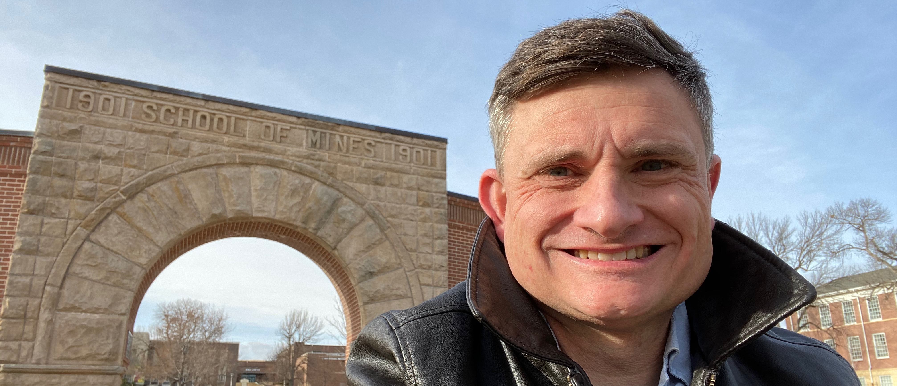

# Bill Capehart, Ph.D, M.ASCE
<a href="https://orcid.org/0000-0002-4926-0992">

0000-0002-4926-0992</a>
&nbsp;&nbsp;&nbsp;&nbsp;

&nbsp;&nbsp;&nbsp;&nbsp;
<a href="https://www.linkedin.com/in/william-capehart/"><i style="font-size:24px" color="#0f4fb5" class="fa">&#xf08c;</i></a>
&nbsp;&nbsp;&nbsp;&nbsp;
<a href="https://github.com/wjcapehart"><i style="font-size:24px" class="fa">&#xf09b;</i></a>

## About Me

I am an Associate Professor in Atmospheric and Environmental Sciences & Civil and Environmental Engineering at the South Dakota School of Mines and Technology. I received my M.S. and Ph.D. in Meteorology from Penn State and my B.S. in Atmospheric Sciences from the University of North Carolina at Asheville. Currently at SD Mines, I am the program director of the Atmospheric and Environmental Sciences Program.

My research interests are the remote sensing and modeling of surface features and land-surface processes with emphasis on applications in operational meteorology, risk and hazard assessment, numerical weather and regional climate prediction, and land-surface hydrology. In particular, I’m interested in developing tools to examine the role of land cover, vegetation and subsurface processes on the hydrologic cycle and the influence in climate change and extreme weather events on natural and designed surface systems.

My teaching specialties revolve around climate change and resiliency, numerical weather prediction, boundary layer meteorology, computing in the geosciences, numerical methods and environmental modeling. I've also taught courses in remote sensing, and synoptic meteorology.

## Contact Information

[Dr. Bill Capehart](https://www.sdsmt.edu/about/directory/capehart_-william.html), Associate Professor 
Coordinator, Atmospheric & Environmental Sciences Program 
Civil & Environmental Engineering 
South Dakota Mines 
501 E. Saint Joseph St.  Rapid City, SD 57701 
Phone (VOIP) +1 (605) 394-2264 | <a href="mailto:{{ site.email | encode_email }}" title="Contact me">Email me</a>
